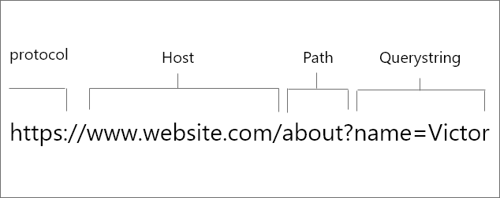

# Chapter 01 - Crash Course Node.js

## About Node.js

### What is Node.js

* Open source server environment
* Free
* Runs on various platforms (Windows, Linux, Unix, Mac OS X, etc.)
* Uses JavaScript on the server

Node isn't a silver bullet, it's not always the best solution for every project.

### Before Node.js

* WebApps are written in client/server model
* Client requests file from server
* Server gets file (waits) from filesystem and returns it, then closes connection
* Ready for new connection

#### What about multiple clients

* Threads
  * Running multiple operations concurrently
* Starting up new threads had a cost (overhead)

### Here came Node.js

* Client requests file from server
* Node.js requests the file from the file system but doesn't wait
* Ready to handle the next request.
* When the file system has opened and read the file, the server is notified and it returns the content to the client.

## Creating Apps

* Create a folder
* `npm init` to setup a `package.json` file
* Create entry point for example `server.js` and add `console.log("Hello World!")`

## Basic WebApps

* Writing web apps with Node involves writing event handlers
  * Functions that get called when certain Node events occur.

### http server

Run using `npm start` (if script is configured) or `node server.js`.

```js
const http = require('http');
const server = http.createServer();

server.on('request', (request, response) => {
   response.writeHead(200, {'Content-Type':'text/plain'});
   response.write('Hello world');
   response.end();
});

server.listen(3000, () => {
  console.log('Node server created at port 3000');
});
```

Check it out using your browser at [http://localhost:3000](http://localhost:3000).

### Callbacks everywhere

* Functions that respond to events
* Node.js is a single threaded environments
* Almost everything works with callbacks
  * Better get used to it

### Routing

* Serving different routes

```js
const http = require('http');
const url = require('url');

const server = http.createServer();

const set_response = (response, content) => {
  response.writeHead(200, {'Content-Type':'text/plain'});
  response.write(content);
}

server.on('request', (request,response) => {
  let path = url.parse(request.url).pathname;
  console.log(path);

  if (path === '/') {
    set_response(response, 'Hello world');
  } else if (path === '/about') {
    set_response(response, 'Created by VIVES peoples');
  } else {
    response.writeHead(404, {'Content-Type':'text/plain'});
    response.write('Error page');
  }
  response.end();
});

server.listen(3000, () => {
  console.log('Node server created at port 3000');
});
```

* Routes:
  * [http://localhost:3000](http://localhost:3000)
  * [http://localhost:3000/about](http://localhost:3000/about)

* url package breaks up the URL



* Fun to do, but nobody does it like this

### Express Routing

* Use a framework such as Express for building APIs and such
* Install using `npm install express --save`

```js
const express = require('express');
const app = express();
const PORT = 3000;

//Basic routes
app.get('/', (request,response) => {
   response.send('Hello World');
});

app.get('/about',(request,response) => {
   response.send('This app was made by VIVES peoples');
});

//Express error handling middleware
app.use((request,response) => {
   response.type('text/plain');
   response.status(505);
   response.send('Error page');
});

app.listen(PORT, () => console.log(`Example app listening on port ${PORT}!`))
```

## Interval and TimeOut

* Timeout
  * Call a function after number of milliseconds

```js
setTimeout(() => {
  console.log("!")
}, 1000);
```

* Interval
  * Call a function every number of milliseconds

```js
setInterval(() => {
  console.log("!")
}, 1000);
```

## Classes

* No private methods
* `constructor`
* No multiple inheritance
* Attributes: `this.`

## Arrow functions

* One of the most heralded features in modern JavaScript
* Sometimes called 'fat arrow' functions
* Utilizing the new token `=>`

### Benefits

* A very clean concise syntax
* More intuitive scoping and `this` binding.

### What are they

* Anonymous functions with their own special syntax
* Operate in the context of their enclosing scope - ie the function or other code where they are defined.

### Example

* A list of arguments within parenthesis, followed by a 'fat arrow' `=>`, followed by a function body.

```js
const add = (a, b) => { return a + b };
//...
let x = add(3, 8);
console.log(x);
```

* If the function body is a single expression, you can leave off the brackets and put it inline. The results of the expression will be returned by the function.

```js
const add = (a, b) => a + b;
//...
let x = add(3, 8);
console.log(x);
```

* If there is only a single argument, you can even leave off the parenthesis around the argument.

```js
const first = array => array[0];
//...
let x = first([99, 32, 0]);
console.log(x);
```

### Enclosing Scope Context

* Unlike every other form of function, arrow functions do not have their own execution context.
* Practically, this means that both `this` and `arguments` are inherited from their parent function.

```js
const myObject = {
  name: 'My Test Object',
  createAnonymFunction: function() {
    return function() {
      console.log(this.name);
      console.log(arguments);
    };
  },

  createArrowFunction: function() {
    return () => {
      console.log(this.name);
      console.log(arguments);
    };
  }
};

const anon = myObject.createAnonymFunction('hello', 'world');
const arrow = myObject.createArrowFunction('hello', 'world');

console.log("Anonymous:");
anon();

console.log("\r\nArrow:");
arrow();
```

::: codeoutput
<pre>
Anonymous:
undefined
[Arguments] {}

Arrow:
My Test Object
[Arguments] { '0': 'hello', '1': 'world' }
</pre>
:::

## Modules

* Consider modules to be the same as JavaScript libraries.
* A set of functions you want to include in your application.
* Built-in modules: [reference](https://www.w3schools.com/nodejs/ref_modules.asp)

### Including

* To include a module, use the `require()` function with the name of the module

```js
const http = require('http');
```

### Creating Modules

* You can create your own modules
* Use the `exports` keyword to make classes, function, ... available outside the module file.
* Use `require('./my_module')` to include the module

https://www.w3schools.com/nodejs/nodejs_modules.asp

```js
// logger.js
class Logger {
  static log(message) {
    console.log("Logger: " + message)
  }
}

module.exports = Logger;
```

```js
//server.js
const Logger = require('./logger')

setTimeout(() => {
  Logger.log("?")
}, 1000);
```

## Promises

https://medium.com/javascript-scene/master-the-javascript-interview-what-is-a-promise-27fc71e77261
https://nodejs.dev/understanding-javascript-promises

## Emitting Events

* Node.js has a built-in module, called "Events"
* Allows firing and listening for own events
* By extending the `EventEmitter` class, we can listen for events on instances of our class

```js
//ticker.js
const EventEmitter = require('events');

class Ticker extends EventEmitter {

  constructor() {
    super();
    this.seconds = 0;
    this.minutes = 0;

    setInterval(() => {
      this.seconds++;
      this.emit('second', { seconds: this.seconds });
    }, 1000);

    setInterval(() => {
      this.minutes++;
      this.emit('minute', { minutes: this.minutes });
    }, 60000);
  }

}

module.exports = Ticker;
```

```js
//app.js
const Ticker = require('./ticker');

let tick = new Ticker();

tick.on('second', (event) => console.log("Second passed " + JSON.stringify(event)));
tick.on('minute', (event) => console.log("Minute passed " + JSON.stringify(event)));
```

## The Event Loop


### Node.js is single-threaded

* Basically program that waits for events and dispatches them
* JS is single-threaded and so is Node

#### Background workers

* Single thread
  * Single thing happening at a time
  * Simplifies programming without needing to worry about concurrency issues
* Work is delegated to background workers
* Workers emit events when finished

### Call stack

<!-- https://nodejs.dev/the-nodejs-event-loop -->

```js
const foundations = () => console.log('Laying foundations')

const basement = () => console.log('Digging a basement')

const walls = () => console.log('Building walls')

const build_a_house = () => {
  console.log('Building a house')
  foundations()
  basement()
  walls()
}

build_a_house()
console.log("Ready?")
```

:::codeoutput
<pre>
Building a house
Laying foundations
Digging a basement
Building walls
Ready?
</pre>
:::

### Example using Timeout

Basically something async that takes time to do.

```js
const foundations = () => console.log('Laying foundations')

const basement = () => console.log('Digging a basement')

const walls = () => console.log('Building walls')

const build_a_house = () => {
  console.log('Building a house')
  foundations()
  setTimeout(basement, 0)       // defers function
  walls()
}

build_a_house()
console.log("Ready?")
```

:::codeoutput
<pre>
Building a house
Laying foundations
Building walls
Ready?
Digging a basement
</pre>
:::

### Message Queue

* Timer is started
* When expired, callback is placed in Message Queue
  * Contains user-initiated events
  * Message Queue is processed if call stack is empty

#### Call stack gets priority

* Event loop gives priority to call stack
  * It first processes everything it finds in the call stack
  * If call stack is empty it picks things from the Message Queue

### Job Queue

* ECMAScript 2015 introduced the concept of the Job Queue
* Used by Promises.
* A way to execute the result of an async function as soon as possible
  * rather than being put at the end of the call stack.
* Promises that resolve before the current function ends will be executed right after the current function.

#### An example

```js
const foundations = () => console.log('Laying foundations')

const basement = () => console.log('Digging a basement')

const walls = () => console.log('Building walls')

const build_a_house = () => {
  console.log('Building a house')
  foundations()
  setTimeout(basement, 0)       // defers function
  new Promise((resolve, reject) =>
    resolve('Lets put on a roof')
  ).then(resolve => console.log(resolve))
  walls()
}

build_a_house()
console.log("Ready?")
```

:::codeoutput
<pre>
Building a house
Laying foundations
Building walls
Ready?
Lets put on a roof
Digging a basement
</pre>
:::
