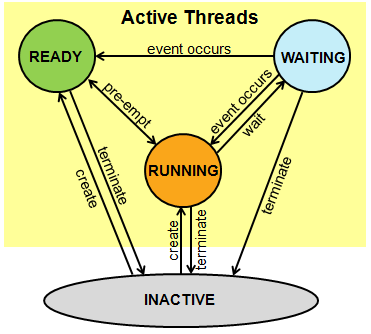

# Basic Threads

A thread is also known as lightweight process. The idea is to achieve parallelism by dividing a process into multiple threads. For example, in a browser, multiple tabs can be different threads. MS Word uses multiple threads: one thread to format the text, another thread to process inputs, etc.

A thread is an execution context, which is all the information a CPU needs to execute a stream of instructions.

## Analogy

Suppose you're (representing a Thread) reading a book (represents the CPU), and you want to take a break right now, but you want to be able to come back and resume reading from the exact point where you stopped. One way to achieve that is by jotting down the page number, line number, and word number. So your execution context for reading a book is these 3 numbers.

If you have a roommate, and she's (representing another Thread) using the same technique, she can take the book while you're not using it, and resume reading from where she stopped. Then you can take it back, and resume it from where you were.

Threads work in the same way. A CPU is giving you the illusion that it's doing multiple computations at the same time. It does that by spending a bit of time on each computation. It can do that because it has an execution context for each computation. Just like you can share a book with your friend, many tasks can share a CPU.

On a more technical level, an execution context (therefore a thread) consists of the values of the CPU's registers.

Last: threads are different from processes. A thread is a context of execution, while a process is a bunch of resources associated with a computation. A process can have one or many threads.

## Threads on Mbed OS

The `Thread` class of Mbed OS allows defining, creating and controlling parallel tasks.

::: tip Main
The main function is a special thread function that is started at system initialization. It is the first thread the RTOS schedules.
:::

A Thread can be in the following states:

* **Running**: The currently running thread. Only one thread at a time can be in this state.
* **Ready**: Threads that are ready to run. Once the running thread has terminated or is waiting, the ready thread with the highest priority becomes the running thread.
* **Waiting**: Threads that are waiting for an event to occur.
* **Inactive**: Threads that are not created or terminated. These threads typically consume no system resources.



All the internal thread data structures are part of the C++ class, but by default, the thread stack is allocated on the heap. Memory is allocated at the run time during the call to start method. If you don't want to use dynamic memory, you can provide your own static memory using the constructor parameters.

To create a Thread we need two things:

* An instance of the `Thread` class
* A function/method to execute (representing the work the thread has to do)

Once these two requirements have been met, the `start` method can be called on the `Thread` object which takes in a `callback` wrapping the actual function/method pointer that needs to be provided to the thread to run.

::: tip Callback
A callback is a user provided function that a user may pass to an API. The callback allows the API to execute the user’s code in its own context.

The `Callback` class manages C/C++ function pointers so you don't have to. C++ provides the tools to delegate this complexity to a single class. This class is the Callback class. The Callback class should be familiar to users of the std::function class that C++11 introduced and is available for older versions of C++.
:::

Take a look at the next example that creates two threads. One thread that blinks the LED and another one that periodically outputs a greeting message to the console.

```cpp
#include "mbed.h"

// Blinking rate in milliseconds
#define BLINKING_RATE     500ms

static BufferedSerial pc(USBTX, USBRX, 115200);

// Initialise the digital pin LED1 as an output
DigitalOut led(LED1);

Thread threadBlink;
Thread threadGreet;

void blink(void) {
    while (true) {
        led = !led;     // You can access the global object here !
        ThisThread::sleep_for(chrono::milliseconds(250));
    }
}

void greet(void) {
    int counter = 0;
    while (true) {
        printf("Hello there %d\n", counter++);
        ThisThread::sleep_for(chrono::milliseconds(1000));
    }
}

int main()
{
    printf("Starting Thread Demo1\n");

    // Create thread from blink
    threadBlink.start(callback(&blink));

    // Create thread from greet
    threadGreet.start(callback(&greet));

    while (true) {
        ThisThread::sleep_for(chrono::seconds(10));
    }
}
```

### Thread as Class Attribute

Next is another example of creating a thread inside a class. This time the callbacks needs two pieces of information, the instance on which the processing method needs to be called and a pointer to the processing method.

Let's first take a look at the `AliveLed` class definition.

```cpp
#pragma once

class AliveLed {

    public:
        AliveLed(PinName outPin, unsigned int delay);

    private:
        void run(void);

    private:
        DigitalOut led;
        Thread thread;
        unsigned int delay = 100;
};
```

::: tip Internal Thread
Notice that the Thread is placed as an instance inside the AliveLed object. This is one way to do it. Another approach would have been to create the Thread externally. Depends if you wish to use the class without threads too.
:::

Next is the implementation of the methods:

```cpp
#include "alive_led.h"

AliveLed::AliveLed(PinName outPin, unsigned int delay)
    : led(outPin) {

    this->delay = delay;
    this->led = 0;
    thread.start(callback(this, &AliveLed::run));
}

void AliveLed::run(void) {
    while (true) {
        led = !led;
        ThisThread::sleep_for(chrono::milliseconds(delay));
    }
}
```

Now the `AliveLed` can be used as a threaded instance:

```cpp
#include "mbed.h"
#include "alive_led.h"

// Blinking rate in milliseconds
#define BLINKING_RATE     500ms

static BufferedSerial pc(USBTX, USBRX, 115200);

int main()
{
    printf("Starting Alive LED Demo\n");

    AliveLed alive(LED1, 500);    // Creates thread internally

    while (true) {
        ThisThread::sleep_for(chrono::seconds(10));
    }
}
```

## RTOS Ticker

Platforms using RTOS, including Mbed OS, need a mechanism for counting the time and scheduling tasks. A timer that generates periodic interrupts and is called system tick timer usually does this. Under Mbed OS, we call this mechanism the RTOS ticker.

SysTick is a standard timer available on most Cortex-M cores. Its main purpose is to raise an interrupt with set frequency (usually 1ms). In addition, many Mbed OS platforms implement timers as part of peripherals. Mbed OS supports using SysTick or the peripheral timers as RTOS ticker.
