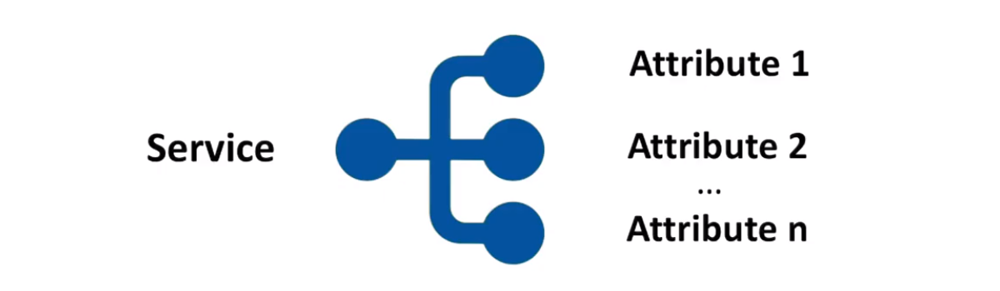
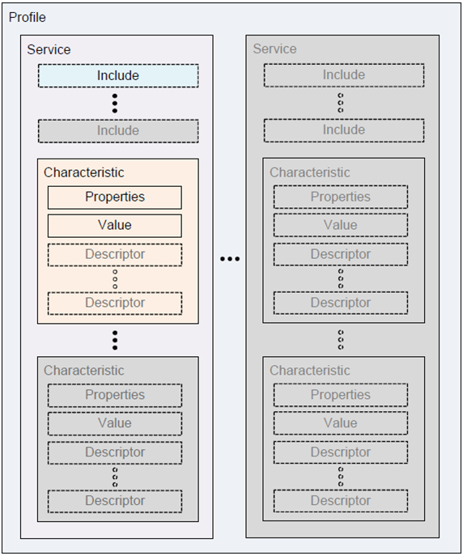
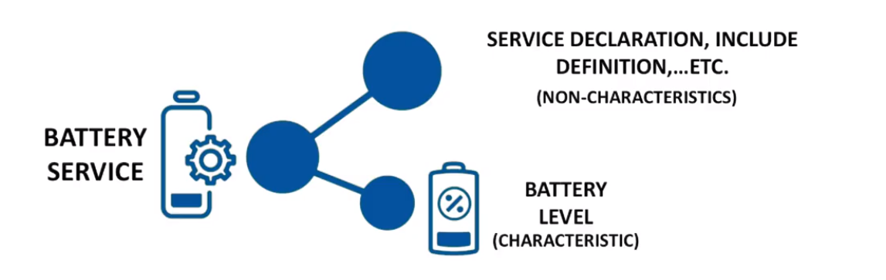
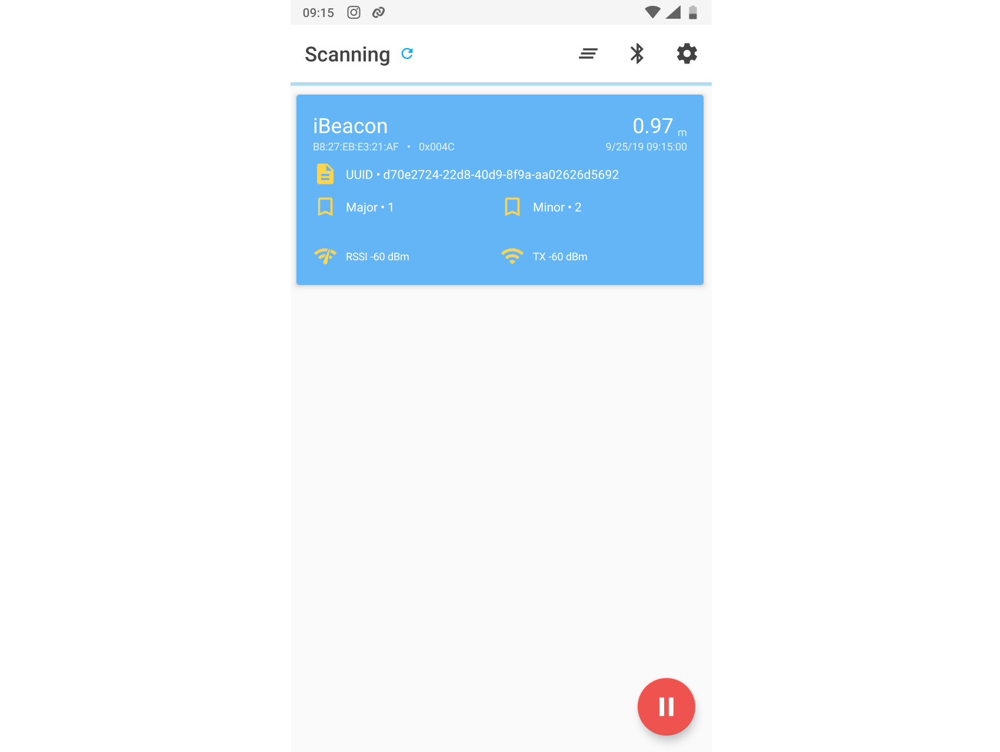

# Chapter 02 - Bluetooth LE on RPi

<!-- TODO - Introduction in Bluetooth -->

## Attribute Protocol (ATT)

* Defines how a server exposes its data to a client
* Also defines how data is structured within the server
  * As attributes

* Client: the device that reads and writes from the server and receives notifications (ex. smartphone)
* Server: the device that exposes the data it controls and allows the client to retrieve it (ex. sensor)

### Attribute

| Handle | UUID | Value | Permissions |
| --- | --- | --- | --- |
| 16-bit | 16-bit (SIG) or 128-bit | xxx | xxx |

* Handle: 16-bit unique identifier for each attribute on the server
* UUID:
  * 16-bit for SIG adopted attributes
    * Replaced the 4th-8th octets (`XXXX`) in the SIG base UUID: `0000XXXX-0000-1000-8000-00805F9B34FB`
    * `0x180F` for Battery Service becomes `0000180F-0000-1000-8000-00805F9B34FB`
    * `0x2A00` for Device Name Characteristic becomes `00002A00-0000-1000-8000-00805F9B34FB`
  * 128-bit for custom attributes
    * No central registry so you can pick your own
    * Should not collide with SIG IDs
    * Use [https://www.uuidgenerator.net/](https://www.uuidgenerator.net/) to generate a UUID.
* Value
  * Holds the data
  * Variable length
  * Format based on the attribute type
* Permissions
  * Determine if it can be read or written to
  * If notifications can be enabled
  * Security levels

<!-- All BLE Assigned Services / Characteristics / Descriptors / ... use the Bluetooth SIG Base UUID -->
<!-- Assigned Characteristics (https://www.bluetooth.com/specifications/gatt/characteristics/). These all seem to start somewhere around `0x2A00`.
Assigned Services (https://www.bluetooth.com/specifications/gatt/services/) on the other hand seem to start at `0x1800`. -->

## Generic Attribute Profile (GATT)

* Defines the format of services and their characteristics
* Defines the procedures to interface with these attributes
  * Service discovery
  * Characteristic reads, writes, notifications, indications
* Same roles (client, server) as ATT

The GATT defines procedures for a client to discover services and characteristics hosted on a server. Client then can read, write or subscribe to selected characteristics.

Contrary to what might be intuitive, the GATT server is usually a Bluetooth peripheral device like a heartbeat monitor. The client on the other hand is a central device like a smartphone.

## Services and Characteristics

* A service groups together related attributes



* Attributes
  * Characteristics
    * Values: ex. the battery level %
      * Maximum is 512 bytes
    * Contains other attributes such as
      * Properties (read, write, Notify, ...)
      * Descriptors (user description, presentation format, unit, ...)
  * Non-characteristic (help structure data within the service)
    * Examples ?



* Both services and characteristics have their own unique UUIDs.

There are also some predefined services and characteristics that unify the way of exchanging common types of information. For example, a device may implement the Battery Service which has a mandatory Battery Level characteristic. This way every client can easily discover battery level reporting functionality in a device, regardless of its type and manufacturer.



Useful links:

* [https://www.bluetooth.com/specifications/gatt/services/](https://www.bluetooth.com/specifications/gatt/services/)
* [https://www.bluetooth.com/specifications/gatt/characteristics/](https://www.bluetooth.com/specifications/gatt/characteristics/)
* [https://www.bluetooth.com/specifications/gatt/descriptors/](https://www.bluetooth.com/specifications/gatt/descriptors/)

Chrome has a nice plugin to display XML files: [XV-XML Viewer](https://chrome.google.com/webstore/detail/xv-%E2%80%94-xml-viewer/eeocglpgjdpaefaedpblffpeebgmgddk?hl=us)

<!-- ## Profiles

Much broader in definition

* Behavior
* Services
* Characteristics
* Connections
* Security -->

<!-- ## Data Operations -->

## Interesting Videos

* [Ellisys Bluetooth Video 1: Intro to Bluetooth Low Energy](https://www.youtube.com/watch?v=eZGixQzBo7Y)
* [Ellisys Bluetooth Video 2: Generic Access Profile](https://www.youtube.com/watch?v=8OfOwD8f2VI)
* [Ellisys Bluetooth Video 3: Advertisements](https://www.youtube.com/watch?v=be9ct7OKI7s)
* [Ellisys Bluetooth Video 4: Connections](https://www.youtube.com/watch?v=YmMDy8qYX_c)
* [Ellisys Bluetooth Video 5: Generic Attribute Profile (GATT)](https://www.youtube.com/watch?v=eHqtiCMe4NA&list=PLYj4Cw17Aw7ypuXt7mDFWAyy6P661TD48&index=5)

## Bleno

* A Node.js module for implementing BLE (Bluetooth Low Energy) peripherals.
* [https://www.npmjs.com/package/bleno](https://www.npmjs.com/package/bleno)

* bleno provides a very nice node.js wrapper on top of BlueZ
* BlueZ is the Linux Bluetooth protocol stack
  * Steep learning curve

* `bleno` is used to implement peripheral devices
* `noble` can be used to implement a central role

* 1 small problem
  * Not actively maintained

* Solution
  * Use [https://www.npmjs.com/package/@abandonware/bleno](https://www.npmjs.com/package/@abandonware/bleno)

* 1 small problem
  * Depends on [https://www.npmjs.com/package/@abandonware/bluetooth-hci-socket](https://www.npmjs.com/package/@abandonware/bluetooth-hci-socket)
    * Which is not node v12 compatible
    * Pull request is pending: [https://github.com/abandonware/node-bluetooth-hci-socket/pull/5](https://github.com/abandonware/node-bluetooth-hci-socket/pull/5)
    * **Fixed in the meantime !**

* Solution was to install pull request branch first
  * Use [https://github.com/akx/node-bluetooth-hci-socket/tree/node-12](https://github.com/akx/node-bluetooth-hci-socket/tree/node-12)

## Setup bleno on RPi 3

* Used Raspbian Buster Lite 2019-07-10 – kernel v4.19

### Update

Make sure to update apt repository index and upgrade system

```shell
sudo apt update
sudo apt upgrade
```

Need to stop the Bluetooth daemon

```shell
sudo systemctl stop bluetooth
sudo systemctl disable Bluetooth
```

Install dependencies

```shell
sudo apt-get install bluetooth bluez libbluetooth-dev libudev-dev
```

### Setup project dir

* Let's build a simple iBeacon peripheral
  * Beacons transmit small amounts of data via Bluetooth Low Energy (BLE)
  * Are often used for indoor location technology
  * In 2013, Apple introduced their own implementation of Beacons — iBeacons

* Create a directory for you ble projects (on the RPi)

```shell
mkdir -p ~/bluetooth/devices/src
```

* Setup git (create github repo)

```shell
cd ~/bluetooth/devices
git init
git remote add origin git@github.com:....
```

* Create script for iBeacon and also `README.md`

```shell
cd ~/bluetooth/devices
touch src/ibeacon.js
touch README.md
```

* Setup npm package and create package.json

```shell
npm init
```

* Might want to share the bluetooth dir using samba (see Linux course)

<!-- ### Install node-bluetooth-hci-socket

Clone the node-bluetooth-hci-socket package locally in the bluetooth dir and checkout the fix branch (node-12)

```shell
cd ~/bluetooth
git clone https://github.com/akx/node-bluetooth-hci-socket.git
git checkout node-12
```

Install the package inside the devices project

```shell
cd ~/bluetooth/devices
npm install ../node-bluetooth-hci-socket --save
``` -->

### Installing the bleno package

* Now bleno can be installed

```shell
cd ~/bluetooth/devices
npm install @abandonware/bleno@latest --save
```

### iBeacon demo

* Place the following code inside the `ibeacon.js` file

```js
const bleno = require("@abandonware/bleno");

// Set your own UUID
const UUID = "d70e2724-22d8-40d9-8f9a-aa02626d5692";

// Choose a value
const MINOR = 2;

// Choose a value
const MAJOR = 1;

// RSSI at 1m distance (for distance calculation)
const TX_POWER = -60;

console.log("Starting bleno ...");
bleno.on("stateChange", state => {
    if (state === 'poweredOn') {
      console.log("Starting broadcast ...");

      bleno.startAdvertisingIBeacon(UUID, MAJOR, MINOR, TX_POWER, err => {
        if(err) {
          console.error(err);
        } else {
          console.log(`iBeacon uuid: ${UUID}, major: ${MAJOR}, minor: ${MINOR}`);
        }
      });
    } else {
      console.log("Stopping broadcast ...");
      bleno.stopAdvertising();
    }
});
```

Use [https://www.uuidgenerator.net/](https://www.uuidgenerator.net/) to generate a UUID.

* Run script as root:

```shell
sudo node src/ibeacon.js
```

* The tx power param does not actually change the power of the transmission. It is declared and used by receivers to estimate the range from the beacon.
* The UUID, Major and Minor parameters are your iBeacon's identifier and make up the key component of the Advertising packets that are continually transmitted by your Beacons.
* UUID stands for Universally Unique Identifier. The purpose of the ID is to distinguish iBeacons in your network, from all other beacons in networks outside your control.
* Major values are intended to identify and distinguish a group – for example, all beacons in on a certain floor or room in your venue could be assigned a unique major value.
* Minor values are intended to identify and distinguish an individual – for example distinguishing individual beacons within a group of beacons assigned a major value.

### Detecting the iBeacon

You can install a

* beacon app such as [Beacon Scanner by Nicolas Bridoux](https://play.google.com/store/apps/details?id=com.bridou_n.beaconscanner&hl=en)
* or use a general BLE app such as [nRF Connect for Mobile](https://play.google.com/store/apps/details?id=no.nordicsemi.android.mcp&hl=en)



## Battery Service of a Railgun

```js
const bleno = require("@abandonware/bleno");

// Choose a concise name for your device
const PERIPHERAL_NAME = "railgun";

// UUID of a Battery Service following SIG
// https://www.bluetooth.com/wp-content/uploads/Sitecore-Media-Library/Gatt/Xml/Services/org.bluetooth.service.battery_service.xml
const BATTERY_SERVICE_UUID = "180F";

// UUID of a Battery Level following SIG
// https://www.bluetooth.com/wp-content/uploads/Sitecore-Media-Library/Gatt/Xml/Characteristics/org.bluetooth.characteristic.battery_level.xml
const BATTERY_LEVEL_CHARACTERISTIC_UUID = "2A19";

class RailGun {
  constructor() {
    this.batteryLevel = 100;

    setInterval(() => {
      this.batteryLevel = Math.max(0, this.batteryLevel-1);
    }, 5000);
  }

  fire() {
    if (this.batteryLevel >= 10) {
      this.batteryLevel = Math.max(0, this.batteryLevel-10);
      console.log(`Cannon goes boom (${this.batteryLevel}% power left)`);
    } else {
      console.log(`Cannon goes pffff - sorry out of power (${this.batteryLevel}% power left)`);
    }
  }

  battery_level() {
    return this.batteryLevel;
  }
}

let hugeCannon = new RailGun();

setInterval(() => {
  hugeCannon.fire();
}, 8000);

class BatteryLevelCharacteristic extends bleno.Characteristic {
  constructor(railgun) {
    super({
      uuid: BATTERY_LEVEL_CHARACTERISTIC_UUID,
      properties: ["read"],
      value: null,
      descriptors: [
        new bleno.Descriptor({
          uuid: "2901",
          value: "Battery Level"
        })
      ]
    });

    this.railgun = railgun;
  }

  onReadRequest(offset, callback) {
    try {
      const level = this.railgun.battery_level();
      console.log(`Returning battery level of: ${level}%`);

      let data = Buffer.alloc(1);   // Single byte
      data.writeUInt8(level, 0);
      callback(this.RESULT_SUCCESS, data);
    } catch (err) {
      console.error(err);
      callback(this.RESULT_UNLIKELY_ERROR);
    }
  }
}

console.log("Starting bleno ...");

bleno.on("stateChange", state => {
  if (state === "poweredOn") {
    bleno.startAdvertising(PERIPHERAL_NAME, [BATTERY_SERVICE_UUID], err => {
      if (err) console.log(err);
    });
  } else {
    console.log("Stopping ...");
    bleno.stopAdvertising();
  }
});

bleno.on("advertisingStart", err => {
  console.log("Configuring services ...");
  
  if(err) {
      console.error(err);
      return;
  }

  let service = new bleno.PrimaryService({
      uuid: BATTERY_SERVICE_UUID,
      characteristics: [
        new BatteryLevelCharacteristic(hugeCannon)
      ]
  });

  bleno.setServices([service], err => {
    if(err) console.log(err);
    else console.log("Services configured");
  });
});

// Some diagnostics
bleno.on("stateChange", state => console.log(`Bleno: Adapter changed state to ${state}`));
bleno.on("advertisingStart", err => console.log("Bleno: advertisingStart"));
bleno.on("advertisingStartError", err => console.log("Bleno: advertisingStartError"));
bleno.on("advertisingStop", err => console.log("Bleno: advertisingStop"));
bleno.on("servicesSet", err => console.log("Bleno: servicesSet"));
bleno.on("servicesSetError", err => console.log("Bleno: servicesSetError"));
bleno.on("accept", clientAddress => console.log(`Bleno: accept ${clientAddress}`));
bleno.on("disconnect", clientAddress => console.log(`Bleno: disconnect ${clientAddress}`));
```
