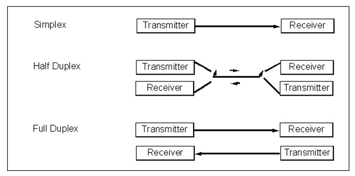

# Serial Communication

Historically, parallel communication was preferred over serial communication, as at an equal clock speed the throughput of data is larger. However, when the clock speed rises, parallel communication poses some serious technical difficulties.

* **Bus skew**: different lengths of data lines result in different delays, this effect is worse when clock speed rises  
* **Cross-talk effects**: at higher frequencies more cross-talk is induced in adjacent lines

Furthermore parallel communication is more expensive

* More lines
* More pins

2 types:

* **Asynchronous:** Byte oriented, synchronization with a frame, which consists of data bits and control, status, synchronization bits
* **Synchronous:** Block oriented, synchronization with extra bytes

## Transfer Rate

Bit rate: bits/second
Baud rate: symbols/second

Remark: in digital communication 1 symbol is represented by 1 bit so `1 bit/s` = `1 Baud/s`

## Duplex Mode

