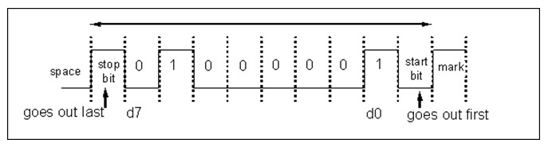
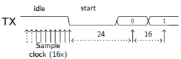

# UART

2 classes of devices

* Data Terminal Equipment (DTE)
* Data Circuit-terminating Equipment (DCE)

Input in one type of device is output in the other & vice versa

Important pins

* TxD: Transmit
* RxD: Receive
* Common Ground

The UART standard also defines other pins for flow control (see DB9 connector).

Bit rates: 75, 110, 300, 1200, 2400, 4800, 9600, 19200, 38400, 57600, 115200, ...

RS232 standard defines voltage levels:

* `1` = -3V to -25V
* `0` = 3V to 25V

## Universal Asynchronous Receiver Transmitter (UART)

A UART is a piece of hardware used to IMPLEMENT RS-232 (though there have been UARTs used for other protocols as well). ... RS232 is a serial communication protocol, a UART (Universal Asynchronous Receiver Transmitter) is a hardware device to implement serial communications.

* Half or full duplex
* Physical layer: Frame: 1 start bit, 8 data bits, 1 optional parity bit, 1 stop bit
* 8N1 (without parity) -> 1 ASCII character per 10 Bd/s
* Some devices might send a different number of data and stop bits
* LSB first

## Synchronization

The UART is asynchronous which means the internal clock signals of receiver and transmitter must be synchronized during communication  
Starting in the idle state the receiver *samples* its RX signal until it detects a high-low transition. Then, it waits 1.5 bit periods to sample its RX signal at what it estimates to be the center of data bit 0. The receiver then samples RX at bit-period intervals until it has read the remaining 7 data bits and the stop bit. From that point this process is repeated.

Successful extraction of the data from a frame requires that, over 10.5 bit periods, the drift of the receiver clock relative to the transmitter clock be less than 0.5 periods in order to correctly detect the stop bit.

