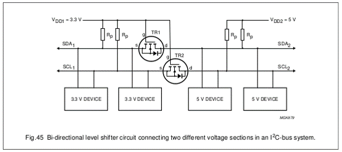

# I2C

Why I2c and not for example serial port? Because serial ports are asynchronous (no clock data is transmitted), devices using them must agree ahead of time on a data rate. The two devices must also have clocks that are close to the same rate, and will remain so–excessive differences between clock rates on either end will cause garbled data.

Another core fault in asynchronous serial ports is that they are inherently suited to communications between two, and only two, devices. While it is possible to connect multiple devices to a single serial port, bus contention (where two devices attempt to drive the same line at the same time) is always an issue and must be dealt with carefully to prevent damage to the devices in question, usually through external hardware.

Finally, data rate is an issue. While there is no theoretical limit to asynchronous serial communications, most UART devices only support a certain set of fixed baud rates.

Why I2C? Because

* Its a common standard
* Its "fast" for low-speed devices
* Bus (multiple devices can be connected)
* Easy to use
* Wide support
* Only 2 communication lines needed (SDA and SCL)
  * SCL is the clock line.
* It is used to synchronize all data transfers over the I2C bus.
  * SDA is the data line.
* The SCL and SDA lines are connected to all devices on the I2C bus
* There does need to be a third wire which is the ground


Both SCL and SDA lines are "open drain" drivers. What this means is that the chip can drive its output low, but it cannot drive it high. For the line to be able to go high you must provide pull-up resistors to Vcc. There should be a resistor from the SCL line to Vcc and another from the SDA line to Vcc. You only need one set of pull-up resistors for the whole I2C bus, not for each device. Vcc depends on the devices used. Typically 5V or 3V3

The devices on the I2C bus are either masters or slaves. The master is always the device that drives the SCL clock line. The slaves are the devices that respond to the master. A slave cannot initiate a transfer over the I2C bus, only a master can do that. There can be, and usually are, multiple slaves on the I2C bus, however there is normally only one master. It is possible to have multiple masters, but it is unusual. Slaves will never initiate a transfer. Both master and slave can transfer data over the I2C bus, but that transfer is always controlled by the master.

Want to know more about I2C, then checkout [https://learn.sparkfun.com/tutorials/i2c](https://learn.sparkfun.com/tutorials/i2c).

## Connecting devices via I2C

Voltage levels should always be checked.

Normally I2C requires you to add a pull-up resistor to each line (SDA and SCL).



::: tip Nucleo L476RG
The Nucleo L476RG has multiple i2c channels. Make sure to pick matching SCL and SDA lines. More info at [https://os.mbed.com/platforms/ST-Nucleo-L476RG/](https://os.mbed.com/platforms/ST-Nucleo-L476RG/)
:::

## Communicating via I2C on mbed

The I2C interface provides I2C Master functionality. I2C is a two wire serial protocol that allows an I2C Master to exchange data with an I2C Slave. You can use it to communicate with I2C devices such as serial memories, sensors and other modules or integrated circuits.

The I2C protocol supports up to 127 devices per bus, and its default clock frequency is 100KHz.

::: tip Pull-up Resistors
Remember that you need a pull-up resistor on sda and scl. All drivers on the I2C bus are required to be open collector, and so it is necessary to use pull-up resistors on the two signals. A typical value for the pull-up resistors is around 2.2k ohms, connected between the pin and 3v3.
:::

### Setting Up the Bus

To setup the i2c bus all one needs to do is create an `I2C` (master) instance, connected to the specified pins.

```cpp
I2C i2cBus(I2C_SDA, I2C_SCL);   // Use correct pins !
i2cBus.frequency(100000);          // Defaults to 100kHz
```

If required, the bus speed can be changed with the `frequency` method.

### Reading from the slave device

The `read()` method will allow one to read a number of bytes from an i2c slave device. It performs a complete read transaction. The bottom bit of the address is forced to `1` to indicate a read operation.

The prototype of the `read()` method is as follows:

```cpp
int read (int address, char * data, int length, bool repeated = false);
```

Where:

* `address`: 8-bit I2C slave address
* `data`: Pointer to the byte-array to read data in to
* `length`: Number of bytes to read
* `repeated`: Repeated start, true - don't send stop at end default value is false.

The `read()` method returns `0` on success (ack), nonzero on failure (nack)

::: warning 8-bit versus 7-bit addresses
The Arm Mbed API uses 8 bit addresses, so make sure to left-shift 7 bit addresses by 1 bit before passing them. Always consult the datasheet of your device to find out what the address of the device is.
:::

So basically to read from an i2c device:

* we need a large enough buffer to store the data in,
* we need to know how many bytes we will receive
* and we need the i2c address of the device

```cpp
I2C i2cBus(I2C_SDA, I2C_SCA);   // Use correct pins !

// ...

const int address = 0x48 << 1;    // 0x48 is the 7-bit address

// ...

const unsigned int EXPECTED_BYTES = 3;
char buffer[EXPECTED_BYTES] = { 0 };

i2cBus.read(address, buffer, EXPECTED_BYTES);
```

### Writing to the slave device

The `write()` method will allow one to write a number of bytes to an i2c slave device. It performs a complete write transaction. The bottom bit of the address is forced to `0` to indicate a write.

The prototype of the `write()` method is as follows:

```cpp
int write (int address, const char * data, int length, bool repeated = false);
```

Where:

* `address`: 8-bit I2C slave address
* `data`: Pointer to the byte-array data to send
* `length`: Number of bytes to send
* `repeated`: Repeated start, true - do not send stop at end default value is false.

The `write()` method returns `0` on success (ack), nonzero on failure (nack)

So basically to write to an i2c device:

* we need a large enough buffer that holds the data that needs to be send to the device,
* we need to know how many bytes to send
* and we need the i2c address of the device

```cpp
I2C i2cBus(I2C_SDA, I2C_SCA);   // Use correct pins !

// ...

const int address = 0x48 << 1;    // 0x48 is the 7-bit address

// ...

const unsigned int PAYLOAD_SIZE = 3;
char data[PAYLOAD_SIZE] = { 0x00, 0x01, 0x02 };

i2cBus.write(address, data, PAYLOAD_SIZE);
```

### Waiting between transactions

When executing multiple read and/or write transactions, it may be necessary to wait between these transactions. This depends on the speed of the peripheral.

```cpp
const unsigned int MS_DELAY = 10;
ThisThread::sleep_for(std::chrono::milliseconds(MS_DELAY));
```

<!-- More info -->
<!-- https://www.analog.com/en/technical-articles/i2c-primer-what-is-i2c-part-1.html# -->
