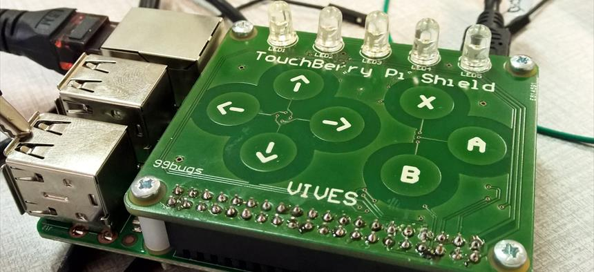

# Challenge - KeyPad Lock

The idea in this challenge is te create a keypad lock.

For this we will make use of the **TouchBerry Pi** shield for the physical user interface, an EEPROM to store our passkey and a LoRaWAN shield for communicating an event (open, lock, alarm, ...).

All these components will be connected to the Nucleo L476RG platform which will also host our firmware.

## Minimal Requirements

* Touch events on the capacitive touch shield need to be detected by the firmware.
* A key needs to be stored (written) to the EEPROM and verified if the user tries to unlock the device.
* The RGB LED's should be used as feedback to the user.
* Send an event via LoRaWAN if the lock is released or locked.
* Make sure to output debug information via the serial port
* Document the workings of the device as well as the physical connections and requirements.

## Strongly recommended options

* Allow the user to program his/her personal key
* Limit the number of tries to for example 3 before generating an alarm event
* Use interrupts instead of polling to detect changes of the capacitive touch

## TouchBerry Pi Shield

The TouchBerry Pi shield is a shield that can be plugged on top of the Raspberry Pi (2 and 3) and enables a touch interface through 7 capacitive buttons. The shield has been released in three different revisions.

<!-- You can find the schematic and component list on the project page at CircuitMaker [https://circuitmaker.com/Projects/Details/Sille-Van-Landschoot-2/TouchBerry-Pi](https://circuitmaker.com/Projects/Details/Sille-Van-Landschoot-2/TouchBerry-Pi). -->

### Version 1.0

This shield has the following hardware on board:

* AT42QT1070 I2C capacitive touch sensor IC [https://www.mouser.com/ds/2/268/Atmel-9596-AT42-QTouch-BSW-AT42QT1070_Datasheet-1065970.pdf](https://www.mouser.com/ds/2/268/Atmel-9596-AT42-QTouch-BSW-AT42QT1070_Datasheet-1065970.pdf)
* TLC59116 I2C-Bus Constant-Current LED Sink Driver [http://www.ti.com/lit/ds/symlink/tlc59116.pdf](http://www.ti.com/lit/ds/symlink/tlc59116.pdf)
* 5 RGB LEDs

### Version 2.0

Version 2.0 of the shield has the following hardware on board:

* AT42QT1070 I2C capacitive touch sensor IC [https://www.mouser.com/ds/2/268/Atmel-9596-AT42-QTouch-BSW-AT42QT1070_Datasheet-1065970.pdf](https://www.mouser.com/ds/2/268/Atmel-9596-AT42-QTouch-BSW-AT42QT1070_Datasheet-1065970.pdf)
* TLC59116 I2C-Bus Constant-Current LED Sink Driver [http://www.ti.com/lit/ds/symlink/tlc59116.pdf](http://www.ti.com/lit/ds/symlink/tlc59116.pdf)
* 5 RGB LEDs
* 24LC65 64K I2C Smart Serial EEPROM [http://ww1.microchip.com/downloads/en/DeviceDoc/21073K.pdf](http://ww1.microchip.com/downloads/en/DeviceDoc/21073K.pdf)
* MCP9800 2-Wire High-Accuracy Temperature Sensor [http://ww1.microchip.com/downloads/en/DeviceDoc/21909d.pdf](http://ww1.microchip.com/downloads/en/DeviceDoc/21909d.pdf)
* MMA8451QT MEMS Accelerometer, 3-Axis [https://www.nxp.com/docs/en/data-sheet/MMA8451Q.pdf](https://www.nxp.com/docs/en/data-sheet/MMA8451Q.pdf)
* An NRF-compatible connector for connecting NRF24l01+ modules (allowing small distance baseband low power wireless communication)

<!-- The schematic of the QT1070 touch sensor and the TLC59116 LED driver is shown below: -->

<!--  -->

<!-- The schematic of the other sensors is shown below: -->

<!--  -->

<!-- * `0x1b`: AT42QT1070 I2C capacitive touch sensor IC -->
<!-- * `0x1c`: MMA8451QT MEMS Accelerometer, 3-Axis -->
<!-- * `0x48`: MCP9800 2-Wire High-Accuracy Temperature Sensor -->
<!-- * `0x50`: 24LC65 64K I2C Smart Serial EEPROM -->
<!-- * `0x60`: TLC59116 I2C-Bus Constant-Current LED Sink Driver -->
<!-- * `0x68`: TLC59116 I2C-Bus Constant-Current LED Sink Driver All Call Address -->

<!-- Notice that all these addresses are the 7bit addresses. Some datasheets specify the 8bit address (R/W bit included as LSB `0`). This means that the 8bit address is the 7bit address multiplied by 2. -->

### Version 3.0

This shield has the following hardware on board:

* AT42QT1070 I2C capacitive touch sensor IC [https://www.mouser.com/ds/2/268/Atmel-9596-AT42-QTouch-BSW-AT42QT1070_Datasheet-1065970.pdf](https://www.mouser.com/ds/2/268/Atmel-9596-AT42-QTouch-BSW-AT42QT1070_Datasheet-1065970.pdf)
* TLC59116 I2C-Bus Constant-Current LED Sink Driver [http://www.ti.com/lit/ds/symlink/tlc59116.pdf](http://www.ti.com/lit/ds/symlink/tlc59116.pdf)
* 5 RGB LEDs

## EEPROM Dongles

The EEPROM dongles have a `24LC64T` chip on board that can be used to store 64kbit of data.

The datasheet can be found at [http://ww1.microchip.com/downloads/en/devicedoc/21189r.pdf](http://ww1.microchip.com/downloads/en/devicedoc/21189r.pdf)

<!-- WIT VLAK (pinnetjes weg van je):
* LINKs: VCC
* MIDDEN: SDA
* RECHTS: NC -->

<!-- CHIP KANT (pinnetjes weg van je):
* LINKS: WP (Write Protect +> connect to ground to enable write )
* MIDDEN: SCL
* RECHTS: GND -->
