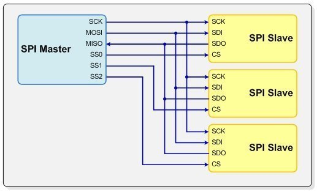

# SPI

* Serial Peripheral Interface (SPI)
* Send data between microcontrollers and peripherals
  * Shift registers
  * Sensor
  * SD Card
  * Display
  * ....
* Data lines, clock and slave select

## Synchronous SPI

### Asynchronous ?

* For example common serial port (TX, RX)
* No common clock
  * Clocks may differ slightly
  * Need to "communicate" at the same pace (baudrate)
* Startbit and stopbit add some synchronization for clock
* If baudrates don't match, sample timing is of and garbage is received

### So what about synchronous ?

* Clock line that keeps both in sync
  * Rising or falling edge triggers sampling
* Speed can often be detected based on clock rate
* Simple hardware (often just a single shift register in case of SPI)

Two Way communications ?

* Only master generates the clock
* Slave can send back data via Master In Slave Out (MISO)
* Master can send back data via Master Out Slave In (MOSI)
* Full duplex (both can send at the same time)

Slave selection via Slave Select (SS) - often active low

## Pros and Cons

**Advantages of SPI:**

* It's faster than asynchronous serial
* The receive hardware can be a simple shift register
* It supports multiple peripherals

**Disadvantages of SPI:**

* It requires more signal lines (wires) than other communications methods
* The communications must be well-defined in advance (you can't send random amounts of data whenever you want)
* The controller must control all communications (peripherals can't talk directly to each other)
* It usually requires separate CS lines to each peripheral, which can be problematic if numerous peripherals are needed.
