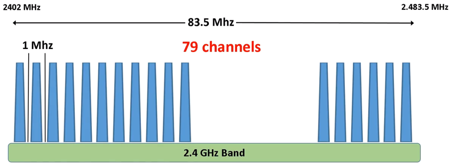
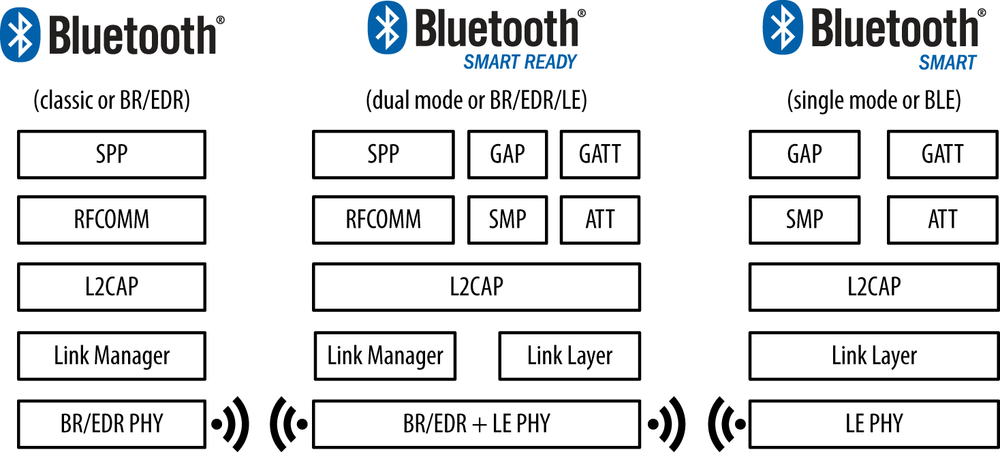
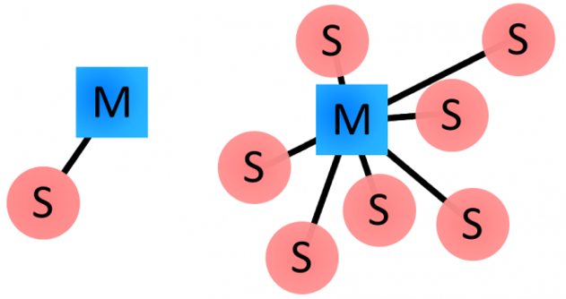
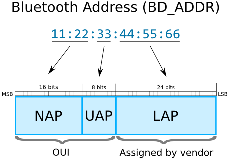
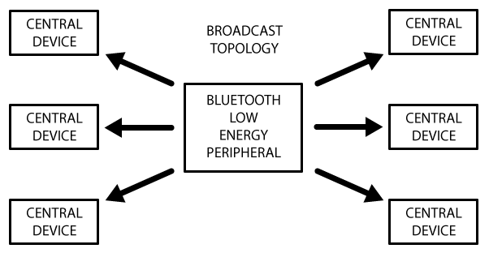
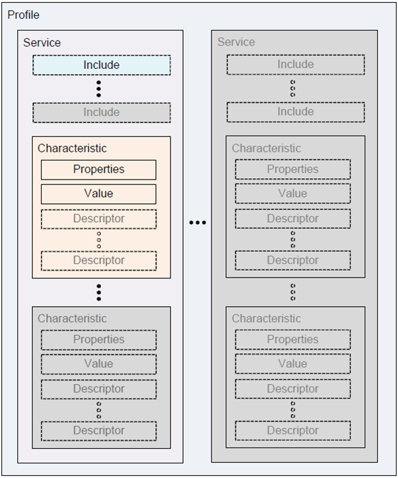

# Chapter 02 - Bluetooth Low Energy on RPi

<!-- Some useful links: -->
<!-- https://www.skyrise.tech/blog/tech/bluetooth-raspberry-pi-bleno-part-1-ibeacon/ -->
<!-- https://www.nativescript.org/blog/controlling-robots-with-nativescript-Bluetooth -->
<!-- https://learn.sparkfun.com/tutorials/bluetooth-basics/all -->

## About Bluetooth

* Wireless communication standard
* Standardized protocol
  * Use to be IEEE Standard 802.15.1 (Bluetooth 1.x)
  * Now SIG (Bluetooth Special Interest Group), 35’000+ companies
* 2.4GHz ISM (Industrial, Scientific and Medical band)
  * Same as ZigBee and WiFi
* Short range
* Low power
* Low cost

### FHSS Technology

* Utilizes frequency-hopping spread spectrum (FHSS) technology to avoid interference problems
  * 79 channels
  * 1600 hops/second
  * Adaptive system
    * Change hopping pattern based on interference



### Some Versions of Bluetooth

* **Bluetooth 1.2**
  * Most stable versions of v1.x
  * Data rates up to 1Mbps (0.7Mbps in practice)
  * 10m maximum range

* **Bluetooth 2.0 + EDR**
  * EDR = Enhanced Data Rates
    * 3Mbps (2.1Mbps in practice)

* **Bluetooth 2.1 + EDR**
  * SSP = Secure Simple Pairing
    * Improves pairing experience
  * v2.1 modules are still very common

* **Bluetooth 3.0 + HS**
  * High Speed (not mandatory)
  * Max speed of 24Mbps (actually over Wifi)
    * Bluetooth only used to establish and manage connection
  * Introduced better power control and streaming

* **Bluetooth 4.0**
  * Includes Classic Bluetooth, Bluetooth high speed and Bluetooth Low Energy (BLE) protocols.
  * Bluetooth Low Energy (BLE)
    * Previously known as Wibree (by Nokia)
    * Also called Bluetooth Smart
    * Subset of Bluetooth v4.0 with an entirely new protocol stack
    * Aimed at very low power applications
    * Up to 50m and max 0.27Mbps
    * Not compatible with Bluetooth Classic
  * Bluetooth Smart: single mode, BLE-radio only
  * Bluetooth Smart Ready: dual mode, BR (BasicRate)/EDR + BLE-radio
    * Typically smartphone or tablet



* **Bluetooth 5**
  * New features are mainly focused on Internet of Things
  * BLE
    * Double speed (2Mbps burst) at expense of range
    * 4x range at expense of data rate
    * Connectionless services

### Piconets

* Single master (central) network
* Bluetooth classic allows up to 7 slave devices (peripheral)
* Slaves can only talk to master, not to each other
* Master coordinates communication



### Bluetooth Address

* Unique identifier for device



* 48 bits
  * NAP - Non-significant Address Part (2 bytes). Contains first 16 bits of the OUI. The NAP value is used in Frequency Hopping Synchronization frames.
  * UAP - Upper Address Part (1 byte). Contains remaining 8 bits of the OUI. The UAP value is used for seeding in various Bluetooth specification algorithms.
  * LAP - Lower Address Part (3 bytes). This portion of Bluetooth Address is allocated by the vendor of device. The LAP value uniquely identifies a Bluetooth device as part of the Access Code in every transmitted frame.

* OUI prefixes are assigned by the Institute of Electrical and Electronics Engineers (IEEE).
* The LAP and the UAP make the significant address part (SAP) of the Bluetooth Address.

### Bluetooth Profiles

* Bluetooth spec defines how the technology works
* Bluetooth profiles defines how it is used
* The profile(s) a Bluetooth device supports determine(s) what application it is geared towards
* Examples
  * A hands-free Bluetooth headset would use the headset profile (HSP)
  * A Nintendo Wii controller would implement the human interface device (HID) profile.
  * Basic serial communication can be achieved using the Serial Port Profile (SPP)
* For two Bluetooth devices to be compatible, they must support the same profiles
  * Help to ensure the interoperability between Bluetooth devices.

<!-- Just because Bluetooth devices can connect to each other does not mean that they can perform functions or Applications. -->

* Advanced Audio Distribution Profile (A2DP)
* Attribute Profile (ATT)
* Audio/Video Remote Control Profile (AVRCP)
* Basic Imaging Profile (BIP)
* Basic Printing Profile (BPP)
* Common ISDN Access Profile (CIP)
* Cordless Telephony Profile (CTP)
* Device ID Profile (DIP)
* Dial-up Networking Profile (DUN)
* Fax Profile (FAX)
* File Transfer Profile (FTP)
* Generic Audio/Video Distribution Profile (GAVDP)
* Generic Access Profile (GAP)
* Generic Attribute Profile (GATT)
* Generic Object Exchange Profile (GOEP)
* Hard Copy Cable Replacement Profile (HCRP)
* Health Device Profile (HDP)
* Hands-Free Profile (HFP)
* Human Interface Device Profile (HID)
* Headset Profile (HSP)
* Intercom Profile (ICP)
* LAN Access Profile (LAP)
* Mesh Profile (MESH)
* Message Access Profile (MAP)
* OBject EXchange (OBEX)
* Object Push Profile (OPP)
* Personal Area Networking Profile (PAN)
* Phone Book Access Profile (PBAP, PBA)
* Proximity Profile (PXP)
* Serial Port Profile (SPP)
* Service Discovery Application Profile (SDAP)
* SIM Access Profile (SAP, SIM, rSAP)
* Synchronization Profile (SYNCH)
* Synchronisation Mark-up Language Profile (SyncML)
* Video Distribution Profile (VDP)
* Wireless Application Protocol Bearer (WAPB)

## Bluetooth Low Energy

* Light-weight subset of classic Bluetooth
* Introduced as part of the Bluetooth 4.0 core specification.
* While there is some overlap with classic Bluetooth, BLE actually has a completely different lineage and was started by Nokia as an in-house project called *Wibree* before being adopted by the Bluetooth SIG.

<!-- A BLE peripheral can only be connected to one central device (a mobile phone, etc.) at a time! As soon as a peripheral connects to a central device, it will stop advertising itself and other devices will no longer be able to see it or connect to it until the existing connection is broken. -->

### BLE Platform Support

* iOS5+ (iOS7+ preferred)
* Android 4.3+ (numerous bug fixes in 4.4+)
* Apple OS X 10.6+
* Windows 8 (XP, Vista and 7 only support Bluetooth 2.1)
* GNU/Linux Vanilla BlueZ 4.93+

## Generic Access Profile (GAP)

Provides the basis for all other profiles. GAP defines how two Bluetooth units discover and establish a connection with each other.

* Controls connections and advertising in Bluetooth.
* GAP is what makes your device visible to the outside world, and determines how two devices can (or can't) interact with each other.
* Defines roles for devices
  * **Peripheral**: devices are small, low power, resource constrained devices that can connect to a much more powerful central device.
    * Peripheral devices are things like a heart rate monitor, a BLE enabled proximity tag, etc.
  * **Central**: devices are usually the mobile phone or tablet that you connect to with far more processing power and memory.

* A peripheral will set a specific advertising interval, and every time this interval passes, it will retransmit it's main advertising packet.
* Most peripherals advertise themselves so that a connection can be established and GATT services and characteristics can be used (which allows for much more data to be exchanged and in both directions)

### Broadcast Network Topology

* The main use case here is where you want a peripheral to send data to more than one device at a time.
* This is only possible using the advertising packet since data sent and received in connected mode can only be seen by those two connected devices.
* By including a small amount of custom data in the 31 byte advertising or scan response payloads, you can use a low cost Bluetooth Low Energy peripheral to sent data one-way to any devices in listening range
* This is the approach use by Apple's iBeacon



Once you establish a connection between your peripheral and a central device, the advertising process will generally stop and you will typically no longer be able to send advertising packets out anymore

## Generic Attribute Profile (GATT)

Provides profile discovery and description services for Bluetooth Low Energy protocol. It defines how ATT attributes are grouped together into sets to form services.

* Defines the way that two Bluetooth Low Energy devices transfer data back and forth
  * Using concepts called Services and Characteristics.
* Makes use of a generic data protocol called the Attribute Protocol (ATT)
  * Stores Services, Characteristics and related data in a simple lookup table using 16-bit IDs for each entry in the table.
* GATT comes into play once a dedicated connection is established between two devices
  * Meaning that you have already gone through the advertising process governed by GAP.

* Defines the format of services and their characteristics
* Defines the procedures to interface with these attributes
  * Service discovery
  * Characteristic reads, writes, notifications, indications
* Same roles (client, server) as ATT

The GATT defines procedures for a client to discover services and characteristics hosted on a server. Client then can read, write or subscribe to selected characteristics.

Contrary to what might be intuitive, the GATT server is usually a Bluetooth peripheral device like a heartbeat monitor. The client on the other hand is a central device like a smartphone.

* Connections are exclusive. What is meant by that is that a BLE peripheral can only be connected to one central device (a mobile phone, etc.) at a time! As soon as a peripheral connects to a central device, it will stop advertising itself and other devices will no longer be able to see it or connect to it until the existing connection is broken.

### Attribute Protocol (ATT)

* Defines how a server exposes its data to a client
* Also defines how data is structured within the server
  * As attributes

* Client: the device that reads and writes from the server and receives notifications (ex. smartphone)
* Server: the device that exposes the data it controls and allows the client to retrieve it (ex. sensor)

### Profiles


A Profile doesn't actually exist on the BLE peripheral itself, it's simple a pre-defined collection of Services that has been compiled by either the Bluetooth SIG or by the peripheral designers. The Heart Rate Profile, for example, combines the Heart Rate Service and the Device Information Service.

### Services


* Services are used to break data up into logic entities, and contain specific chunks of data called characteristics.
* A service can have one or more characteristics
* Each service distinguishes itself from other services by means of a unique numeric ID called a UUID
  * Can be either 16-bit (for officially adopted BLE Services)
  * 128-bit (for custom services).

Example:

* Heart Rate Service
  * 16-bit UUID of `0x180D`
  * Contains up to 3 characteristic
    * Heart Rate Measurement (mandatory)
    * Body Sensor Location (optional)
    * Heart Rate Control Point (optional)

See [https://www.bluetooth.com/specifications/gatt/services/](https://www.bluetooth.com/specifications/gatt/services/).


### Characteristics

* Encapsulates a single data point
  * May contain an array of related data, such as X/Y/Z values from a 3-axis accelerometer

* Each Characteristic distinguishes itself via either
  * a pre-defined 16-bit (ensures interoperability across and BLE-enabled HW/SW)
  * or a custom 128-bit UUID

Example:

* Heart Rate Measurement characteristic is mandatory for the Heart Rate Service
  * Uses a UUID of `0x2A37`.
  * It starts with a single 8-bit value describing the HRM data format (whether the data is UINT8 or UINT16, etc.), and then goes on to include the heart rate measurement data that matches this config byte.

* Characteristics
  * Values: ex. the battery level %
    * Maximum is 512 bytes
  * Contains other information such as
    * Properties (read, write, Notify, ...)
    * Descriptors (user description, presentation format, unit, ...)
      * A Descriptor is an attribute that describes a Characteristic Value.

#### Attributes

An attribute is labeled, addressable data.

Services, characteristics and descriptors ... are actually attributes

* The BLE standard provides the ATT protocol that defines the concept of attributes.
* All attributes are defined inside a table and they have an handle, a type (with an UUID), a value (and permissions).
* On top of ATT protocol in the BLE stack you have GATT and GAP.
* The GATT protocol defines services, characteristics and descriptors and each of them is an attribute.

For example, a characteristic is an attribute with an handle, a type (an UUID that tells us that the attribute is a characteristic) and a value (the characteristic properties with handle to the attribute value and so on). Inside the characteristic you have an attribute that is the value of the characteristic and one or more descriptors that are attributes themselves.

You can see the attribute concept as the abstract type you can define concrete types like service, characteristic and descriptors.

| Handle | UUID | Value | Permissions |
| --- | --- | --- | --- |
| 16-bit | 16-bit (SIG) or 128-bit | xxx | xxx |

* Handle: 16-bit unique identifier for each attribute on the server
* UUID:
  * 16-bit for SIG adopted attributes
    * Replaced the 4th-8th octets (`XXXX`) in the SIG base UUID: `0000XXXX-0000-1000-8000-00805F9B34FB`
    * `0x180F` for Battery Service becomes `0000180F-0000-1000-8000-00805F9B34FB`
    * `0x2A00` for Device Name Characteristic becomes `00002A00-0000-1000-8000-00805F9B34FB`
  * 128-bit for custom attributes
    * No central registry so you can pick your own
    * Should not collide with SIG IDs
    * Use [https://www.uuidgenerator.net/](https://www.uuidgenerator.net/) to generate a UUID.
* Value
  * Holds the data
  * Variable length
  * Format based on the attribute type
* Permissions
  * Determine if it can be read or written to
  * If notifications can be enabled
  * Security levels

<!-- All BLE Assigned Services / Characteristics / Descriptors / ... use the Bluetooth SIG Base UUID -->
<!-- Assigned Characteristics (https://www.bluetooth.com/specifications/gatt/characteristics/). These all seem to start somewhere around `0x2A00`.
Assigned Services (https://www.bluetooth.com/specifications/gatt/services/) on the other hand seem to start at `0x1800`. -->



* Both services and characteristics have their own unique UUIDs.

Useful links:

* [https://www.bluetooth.com/specifications/gatt/services/](https://www.bluetooth.com/specifications/gatt/services/)
* [https://www.bluetooth.com/specifications/gatt/characteristics/](https://www.bluetooth.com/specifications/gatt/characteristics/)
* [https://www.bluetooth.com/specifications/gatt/descriptors/](https://www.bluetooth.com/specifications/gatt/descriptors/)

Chrome has a nice plugin to display XML files: [XV-XML Viewer](https://chrome.google.com/webstore/detail/xv-%E2%80%94-xml-viewer/eeocglpgjdpaefaedpblffpeebgmgddk?hl=us)

### Notifications

Sometimes it is useful to push information to a connected client instead of waiting for it to pull it. An example could be a heartbeat monitor that pushes information about the reading after each detected change. Fortunately, GATT provides us with a way to implement such scenario. A characteristic may support notification mode, so that a client can subscribe to it.

## Interesting Videos on BLE

* [Ellisys Bluetooth Video 1: Intro to Bluetooth Low Energy](https://www.youtube.com/watch?v=eZGixQzBo7Y)
* [Ellisys Bluetooth Video 2: Generic Access Profile](https://www.youtube.com/watch?v=8OfOwD8f2VI)
* [Ellisys Bluetooth Video 3: Advertisements](https://www.youtube.com/watch?v=be9ct7OKI7s)
* [Ellisys Bluetooth Video 4: Connections](https://www.youtube.com/watch?v=YmMDy8qYX_c)
* [Ellisys Bluetooth Video 5: Generic Attribute Profile (GATT)](https://www.youtube.com/watch?v=eHqtiCMe4NA&list=PLYj4Cw17Aw7ypuXt7mDFWAyy6P661TD48&index=5)
* [Nordic Semiconductor - Introduction to Bluetooth Smart](https://www.youtube.com/watch?v=BZwOrQ6zkzE)

## Bleno

* A Node.js module for implementing BLE (Bluetooth Low Energy) peripherals.
* [https://www.npmjs.com/package/bleno](https://www.npmjs.com/package/bleno)

* bleno provides a very nice node.js wrapper on top of BlueZ
* BlueZ is the Linux Bluetooth protocol stack
  * Steep learning curve

* `bleno` is used to implement peripheral devices
* `noble` can be used to implement a central role

* 1 small problem
  * Not actively maintained

* Solution
  * Use [https://www.npmjs.com/package/@abandonware/bleno](https://www.npmjs.com/package/@abandonware/bleno)

* 1 small problem
  * Depends on [https://www.npmjs.com/package/@abandonware/bluetooth-hci-socket](https://www.npmjs.com/package/@abandonware/bluetooth-hci-socket)
    * Which is not node v12 compatible
    * Pull request is pending: [https://github.com/abandonware/node-bluetooth-hci-socket/pull/5](https://github.com/abandonware/node-bluetooth-hci-socket/pull/5)
    * **Fixed in the meantime !**

* Solution was to install pull request branch first
  * Use [https://github.com/akx/node-bluetooth-hci-socket/tree/node-12](https://github.com/akx/node-bluetooth-hci-socket/tree/node-12)

## Setup bleno on RPi 3

* Used Raspbian Buster Lite 2019-07-10 – kernel v4.19


<!-- ### Listing Bluetooth adapters -->

<!-- `hciconfig` -->

<!-- The bluetooth system service needs to be disabled for bleno to work, otherwise some operations will just fail silently. This is quite easy to miss.

sudo service bluetooth stop
sudo hciconfig hci0 up # reactivate hci0 or another hciX you want to use -->


### Update

Make sure to update apt repository index and upgrade system

```shell
sudo apt update
sudo apt upgrade
```

Need to stop the Bluetooth daemon

```shell
sudo systemctl stop bluetooth
sudo systemctl disable bluetooth
```

Install dependencies

```shell
sudo apt-get install bluetooth bluez libbluetooth-dev libudev-dev
```

### Setup project dir

* Let's build a simple iBeacon peripheral
  * Beacons transmit small amounts of data via Bluetooth Low Energy (BLE)
  * Are often used for indoor location technology
  * In 2013, Apple introduced their own implementation of Beacons — iBeacons

* Create a directory for you ble projects (on the RPi)

```shell
mkdir -p ~/bluetooth/devices/src
```

* Setup git (create github repo)

```shell
cd ~/bluetooth/devices
git init
git remote add origin git@github.com:....
```

* Create script for iBeacon and also `README.md`

```shell
cd ~/bluetooth/devices
touch src/ibeacon.js
touch README.md
```

* Setup npm package and create package.json

```shell
npm init
```

* Might want to share the bluetooth dir using samba (see Linux course)

<!-- ### Install node-bluetooth-hci-socket

Clone the node-bluetooth-hci-socket package locally in the bluetooth dir and checkout the fix branch (node-12)

```shell
cd ~/bluetooth
git clone https://github.com/akx/node-bluetooth-hci-socket.git
git checkout node-12
```

Install the package inside the devices project

```shell
cd ~/bluetooth/devices
npm install ../node-bluetooth-hci-socket --save
``` -->

### Installing the bleno package

* Now bleno can be installed

```shell
cd ~/bluetooth/devices
npm install @abandonware/bleno@latest --save
```

### iBeacon demo

* Place the following code inside the `ibeacon.js` file

```js
const bleno = require("@abandonware/bleno");

// Set your own UUID
const UUID = "d70e2724-22d8-40d9-8f9a-aa02626d5692";

// Choose a value
const MINOR = 2;

// Choose a value
const MAJOR = 1;

// RSSI at 1m distance (for distance calculation)
const TX_POWER = -60;

console.log("Starting bleno ...");
bleno.on("stateChange", state => {
    if (state === 'poweredOn') {
      console.log("Starting broadcast ...");

      bleno.startAdvertisingIBeacon(UUID, MAJOR, MINOR, TX_POWER, err => {
        if(err) {
          console.error(err);
        } else {
          console.log(`iBeacon uuid: ${UUID}, major: ${MAJOR}, minor: ${MINOR}`);
        }
      });
    } else {
      console.log("Stopping broadcast ...");
      bleno.stopAdvertising();
    }
});
```

Use [https://www.uuidgenerator.net/](https://www.uuidgenerator.net/) to generate a UUID.

* Run script as root:

```shell
sudo node src/ibeacon.js
```

* The tx power param does not actually change the power of the transmission. It is declared and used by receivers to estimate the range from the beacon.
* The UUID, Major and Minor parameters are your iBeacon's identifier and make up the key component of the Advertising packets that are continually transmitted by your Beacons.
* UUID stands for Universally Unique Identifier. The purpose of the ID is to distinguish iBeacons in your network, from all other beacons in networks outside your control.
* Major values are intended to identify and distinguish a group – for example, all beacons in on a certain floor or room in your venue could be assigned a unique major value.
* Minor values are intended to identify and distinguish an individual – for example distinguishing individual beacons within a group of beacons assigned a major value.

### Detecting the iBeacon

You can install a

* beacon app such as [Beacon Scanner by Nicolas Bridoux](https://play.google.com/store/apps/details?id=com.bridou_n.beaconscanner&hl=en)
* or use a general BLE app such as [nRF Connect for Mobile](https://play.google.com/store/apps/details?id=no.nordicsemi.android.mcp&hl=en)


## Battery Service of a Railgun

```js
const bleno = require("@abandonware/bleno");

// Choose a concise name for your device
const PERIPHERAL_NAME = "railgun";

// UUID of a Battery Service following SIG
// https://www.bluetooth.com/wp-content/uploads/Sitecore-Media-Library/Gatt/Xml/Services/org.bluetooth.service.battery_service.xml
const BATTERY_SERVICE_UUID = "180F";

// UUID of a Battery Level following SIG
// https://www.bluetooth.com/wp-content/uploads/Sitecore-Media-Library/Gatt/Xml/Characteristics/org.bluetooth.characteristic.battery_level.xml
const BATTERY_LEVEL_CHARACTERISTIC_UUID = "2A19";

class RailGun {
  constructor() {
    this.batteryLevel = 100;

    setInterval(() => {
      this.batteryLevel = Math.max(0, this.batteryLevel-1);
    }, 5000);
  }

  fire() {
    if (this.batteryLevel >= 10) {
      this.batteryLevel = Math.max(0, this.batteryLevel-10);
      console.log(`Cannon goes boom (${this.batteryLevel}% power left)`);
    } else {
      console.log(`Cannon goes pffff - sorry out of power (${this.batteryLevel}% power left)`);
    }
  }

  battery_level() {
    return this.batteryLevel;
  }
}

let hugeCannon = new RailGun();

setInterval(() => {
  hugeCannon.fire();
}, 8000);

class BatteryLevelCharacteristic extends bleno.Characteristic {
  constructor(railgun) {
    super({
      uuid: BATTERY_LEVEL_CHARACTERISTIC_UUID,
      properties: ["read"],
      value: null,
      descriptors: [
        new bleno.Descriptor({
          uuid: "2901",
          value: "Battery Level"
        })
      ]
    });

    this.railgun = railgun;
  }

  onReadRequest(offset, callback) {
    try {
      const level = this.railgun.battery_level();
      console.log(`Returning battery level of: ${level}%`);

      let data = Buffer.alloc(1);   // Single byte
      data.writeUInt8(level, 0);
      callback(this.RESULT_SUCCESS, data);
    } catch (err) {
      console.error(err);
      callback(this.RESULT_UNLIKELY_ERROR);
    }
  }
}

console.log("Starting bleno ...");

bleno.on("stateChange", state => {
  if (state === "poweredOn") {
    bleno.startAdvertising(PERIPHERAL_NAME, [BATTERY_SERVICE_UUID], err => {
      if (err) console.log(err);
    });
  } else {
    console.log("Stopping ...");
    bleno.stopAdvertising();
  }
});

bleno.on("advertisingStart", err => {
  console.log("Configuring services ...");
  
  if(err) {
      console.error(err);
      return;
  }

  let service = new bleno.PrimaryService({
      uuid: BATTERY_SERVICE_UUID,
      characteristics: [
        new BatteryLevelCharacteristic(hugeCannon)
      ]
  });

  bleno.setServices([service], err => {
    if(err) console.log(err);
    else console.log("Services configured");
  });
});

// Some diagnostics
bleno.on("stateChange", state => console.log(`Bleno: Adapter changed state to ${state}`));
bleno.on("advertisingStart", err => console.log("Bleno: advertisingStart"));
bleno.on("advertisingStartError", err => console.log("Bleno: advertisingStartError"));
bleno.on("advertisingStop", err => console.log("Bleno: advertisingStop"));
bleno.on("servicesSet", err => console.log("Bleno: servicesSet"));
bleno.on("servicesSetError", err => console.log("Bleno: servicesSetError"));
bleno.on("accept", clientAddress => console.log(`Bleno: accept ${clientAddress}`));
bleno.on("disconnect", clientAddress => console.log(`Bleno: disconnect ${clientAddress}`));
```

### Using notifications

There are two methods: `onSubscribe` and `onUnsubscribe`, which will be called when a client subscribes or unsubscribes from the characteristic. The former gives us opportunity to store a callback, that will be later used to notify the client about changes in the data. The `sendNotificationmethod` is called from the timer and makes use of the callback.

A clean way is needed to trigger a notification when the power level of the railgun changes. Good option here is an `EventEmitter`.

```js
const bleno = require("@abandonware/bleno");
const EventEmitter = require('events');

// Choose a concise name for your device
const PERIPHERAL_NAME = "railgun";

// UUID of a Battery Service following SIG
// https://www.bluetooth.com/wp-content/uploads/Sitecore-Media-Library/Gatt/Xml/Services/org.bluetooth.service.battery_service.xml
const BATTERY_SERVICE_UUID = "180F";

// UUID of a Battery Level following SIG
// https://www.bluetooth.com/wp-content/uploads/Sitecore-Media-Library/Gatt/Xml/Characteristics/org.bluetooth.characteristic.battery_level.xml
const BATTERY_LEVEL_CHARACTERISTIC_UUID = "2A19";

class RailGun extends EventEmitter {
  constructor() {
    super();
    this.batteryLevel = 100;

    setInterval(() => {
      this.use_power(1);
    }, 5000);
  }

  fire() {
    if (this.batteryLevel >= 10) {
      this.use_power(10);
      console.log(`Cannon goes boom (${this.batteryLevel}% power left)`);
    } else {
      console.log(`Cannon goes pffff - sorry out of power (${this.batteryLevel}% power left)`);
    }
  }

  use_power(percentage) {
    if (this.batteryLevel >= percentage) {
      this.batteryLevel -= percentage;
      this.emit('batteryLevelChanged', {'battery_level': this.batteryLevel});
    }
  }

  battery_level() {
    return this.batteryLevel;
  }
}

let hugeCannon = new RailGun();

setInterval(() => {
  hugeCannon.fire();
}, 8000);

class BatteryLevelCharacteristic extends bleno.Characteristic {
  constructor(railgun) {
    super({
      uuid: BATTERY_LEVEL_CHARACTERISTIC_UUID,
      properties: ["read", "notify"],
      value: null,
      descriptors: [
        new bleno.Descriptor({
          uuid: "2901",
          value: "Battery Level"
        })
      ]
    });

    this.railgun = railgun;
  }

  onReadRequest(offset, callback) {
    try {
      const level = this.railgun.battery_level();
      console.log(`Returning battery level of: ${level}%`);

      let data = Buffer.alloc(1);   // Single byte
      data.writeUInt8(level, 0);
      callback(this.RESULT_SUCCESS, data);
    } catch (err) {
      console.error(err);
      callback(this.RESULT_UNLIKELY_ERROR);
    }
  }

  onSubscribe(maxValueSize, updateValueCallback) {
    console.log(`Client subscribed to battery level`);
    this.updateValueCallback = updateValueCallback;
    this.railgun.on('batteryLevelChanged', (event) => this.sendNotification(event.battery_level));
  }

  onUnsubscribe() {
    console.log("Client unsubscribed to battery level");
    this.updateValueCallback = null;
  }

  sendNotification(level) {
    if(this.updateValueCallback) {
      console.log(`Sending notification with battery level of: ${level}%`);

      let data = Buffer.alloc(1);   // Single byte
      data.writeUInt8(level, 0);
      this.updateValueCallback(data);
    }
  }
}

console.log("Starting bleno ...");

bleno.on("stateChange", state => {
  if (state === "poweredOn") {
    bleno.startAdvertising(PERIPHERAL_NAME, [BATTERY_SERVICE_UUID], err => {
      if (err) console.log(err);
    });
  } else {
    console.log("Stopping ...");
    bleno.stopAdvertising();
  }
});

bleno.on("advertisingStart", err => {
  console.log("Configuring services ...");
  
  if(err) {
      console.error(err);
      return;
  }

  let service = new bleno.PrimaryService({
      uuid: BATTERY_SERVICE_UUID,
      characteristics: [
        new BatteryLevelCharacteristic(hugeCannon)
      ]
  });

  bleno.setServices([service], err => {
    if(err) console.log(err);
    else console.log("Services configured");
  });
});

// Some diagnostics
bleno.on("stateChange", state => console.log(`Bleno: Adapter changed state to ${state}`));
bleno.on("advertisingStart", err => console.log("Bleno: advertisingStart"));
bleno.on("advertisingStartError", err => console.log("Bleno: advertisingStartError"));
bleno.on("advertisingStop", err => console.log("Bleno: advertisingStop"));
bleno.on("servicesSet", err => console.log("Bleno: servicesSet"));
bleno.on("servicesSetError", err => console.log("Bleno: servicesSetError"));
bleno.on("accept", clientAddress => console.log(`Bleno: accept ${clientAddress}`));
bleno.on("disconnect", clientAddress => console.log(`Bleno: disconnect ${clientAddress}`));
```

### Allowing Recharge

Allowing to recharge the cannot requires to be able to write to the BLE device.

```js
const bleno = require("@abandonware/bleno");
const EventEmitter = require('events');

// Choose a concise name for your device
const PERIPHERAL_NAME = "railgun";

// UUID of a Battery Service following SIG
// https://www.bluetooth.com/wp-content/uploads/Sitecore-Media-Library/Gatt/Xml/Services/org.bluetooth.service.battery_service.xml
const BATTERY_SERVICE_UUID = "180F";

// UUID of a Battery Level following SIG
// https://www.bluetooth.com/wp-content/uploads/Sitecore-Media-Library/Gatt/Xml/Characteristics/org.bluetooth.characteristic.battery_level.xml
const BATTERY_LEVEL_CHARACTERISTIC_UUID = "2A19";

// Custom
const RAILGUN_COMMAND_SERVICE_UUID = "eac9cf2d-1d6e-4ab5-8582-bdc124b15e52";
const RAILGUN_CHARGE_CHARACTERISTIC_UUID = "b65a60ce-b0e9-43a3-a991-4a908a5705bc";

class RailGun extends EventEmitter {
  constructor() {
    super();
    this.batteryLevel = 100;

    setInterval(() => {
      this.use_power(1);
    }, 5000);
  }

  fire() {
    if (this.batteryLevel >= 10) {
      this.use_power(10);
      console.log(`Cannon goes boom (${this.batteryLevel}% power left)`);
    } else {
      console.log(`Cannon goes pffff - sorry out of power (${this.batteryLevel}% power left)`);
    }
  }

  use_power(percentage) {
    if (this.batteryLevel >= percentage) {
      this.batteryLevel -= percentage;
      this.emit('batteryLevelChanged', {'battery_level': this.batteryLevel});
    }
  }

  battery_level() {
    return this.batteryLevel;
  }

  charge(deltaPercentage) {
    this.batteryLevel = Math.min(100, this.batteryLevel + deltaPercentage);
    this.emit('batteryLevelChanged', {'battery_level': this.batteryLevel});
  }
}

let hugeCannon = new RailGun();

setInterval(() => {
  hugeCannon.fire();
}, 8000);

class RailgunChargeCharacteristic extends bleno.Characteristic {
    constructor(railgun) {
        super({
            uuid: RAILGUN_CHARGE_CHARACTERISTIC_UUID,
            properties: ["write"],
            value: null,
            descriptors: [
                new bleno.Descriptor({
                    uuid: "2901",
                    value: "Charge Railgun"
                  })
            ]
        });

        this.railgun = railgun;
    }

    onWriteRequest(data, offset, withoutResponse, callback) {
        try {
            if(data.length != 1) {
                callback(this.RESULT_INVALID_ATTRIBUTE_LENGTH);
                return;
            }

            let value = data.readUInt8();
            console.log(`Received command to charge railgun: ${value}`);
            this.railgun.charge(value);
            callback(this.RESULT_SUCCESS);
        } catch (err) {
            console.error(err);
            callback(this.RESULT_UNLIKELY_ERROR);
        }
    }
}

class BatteryLevelCharacteristic extends bleno.Characteristic {
  constructor(railgun) {
    super({
      uuid: BATTERY_LEVEL_CHARACTERISTIC_UUID,
      properties: ["read", "notify"],
      value: null,
      descriptors: [
        new bleno.Descriptor({
          uuid: "2901",
          value: "Battery Level"
        })
      ]
    });

    this.railgun = railgun;
  }

  onReadRequest(offset, callback) {
    try {
      const level = this.railgun.battery_level();
      console.log(`Returning battery level of: ${level}%`);

      let data = Buffer.alloc(1);   // Single byte
      data.writeUInt8(level, 0);
      callback(this.RESULT_SUCCESS, data);
    } catch (err) {
      console.error(err);
      callback(this.RESULT_UNLIKELY_ERROR);
    }
  }

  onSubscribe(maxValueSize, updateValueCallback) {
    console.log(`Client subscribed to battery level`);
    this.updateValueCallback = updateValueCallback;
    this.railgun.on('batteryLevelChanged', (event) => this.sendNotification(event.battery_level));
  }

  onUnsubscribe() {
    console.log("Client unsubscribed to battery level");
    this.updateValueCallback = null;
  }

  sendNotification(level) {
    if(this.updateValueCallback) {
      console.log(`Sending notification with battery level of: ${level}%`);

      let data = Buffer.alloc(1);   // Single byte
      data.writeUInt8(level, 0);
      this.updateValueCallback(data);
    }
  }
}

console.log("Starting bleno ...");

bleno.on("stateChange", state => {
  if (state === "poweredOn") {
    bleno.startAdvertising(PERIPHERAL_NAME, [BATTERY_SERVICE_UUID], err => {
      if (err) console.log(err);
    });
  } else {
    console.log("Stopping ...");
    bleno.stopAdvertising();
  }
});

bleno.on("advertisingStart", err => {
  console.log("Configuring services ...");
  
  if(err) {
      console.error(err);
      return;
  }

  let batteryService = new bleno.PrimaryService({
      uuid: BATTERY_SERVICE_UUID,
      characteristics: [
        new BatteryLevelCharacteristic(hugeCannon)
      ]
  });

  let commandService = new bleno.PrimaryService({
      uuid: RAILGUN_COMMAND_SERVICE_UUID,
      characteristics: [
          new RailgunChargeCharacteristic(hugeCannon)
      ]
  });

  bleno.setServices([batteryService, commandService], err => {
    if(err) console.log(err);
    else console.log("Services configured");
  });
});

// Some diagnostics
bleno.on("stateChange", state => console.log(`Bleno: Adapter changed state to ${state}`));
bleno.on("advertisingStart", err => console.log("Bleno: advertisingStart"));
bleno.on("advertisingStartError", err => console.log("Bleno: advertisingStartError"));
bleno.on("advertisingStop", err => console.log("Bleno: advertisingStop"));
bleno.on("servicesSet", err => console.log("Bleno: servicesSet"));
bleno.on("servicesSetError", err => console.log("Bleno: servicesSetError"));
bleno.on("accept", clientAddress => console.log(`Bleno: accept ${clientAddress}`));
bleno.on("disconnect", clientAddress => console.log(`Bleno: disconnect ${clientAddress}`));
```
